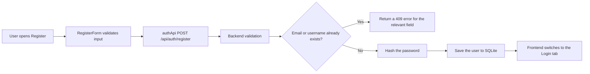
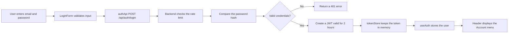
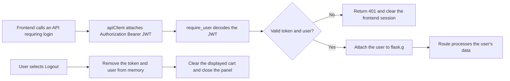

# 01 - User Accounts

## 1. Introduction

- Goal: allow users to register, log in, update their profiles, and log out.
- An account is required to use the cart, check out, and view order history.
- The backend uses Flask, SQLite, and JWT; passwords are stored only as hashes.
- JWTs expire after 2 hours and are kept in frontend memory, rather than in `localStorage`.

## 2. Related Files and Source Code

### Frontend

- `frontend/src/App.tsx`: manages modal visibility and coordinates login and registration.
- `frontend/src/components/layout/Header.tsx`: displays Login, Register, or the account menu.
- `frontend/src/features/auth/components/AuthModal.tsx`: switches between Login and Create account tabs.
- `frontend/src/features/auth/components/LoginForm.tsx`: collects and validates email and password.
- `frontend/src/features/auth/components/RegisterForm.tsx`: collects username, email, password, and password confirmation.
- `frontend/src/features/auth/components/AccountMenu.tsx`: displays the profile, My Orders, and Logout.
- `frontend/src/features/auth/components/ProfileForm.tsx`: updates the full name and phone number.
- `frontend/src/features/auth/useAuth.ts`: manages the user, token, login, and logout.
- `frontend/src/features/auth/authApi.ts`: calls registration, login, and profile APIs.
- `frontend/src/services/apiClient.ts`: sends HTTP requests and attaches the Bearer token.
- `frontend/src/services/tokenStore.ts`: keeps the token in memory and notifies listeners when the session ends.

### Backend

- `backend/routes/auth.py`: APIs for registration, login, and viewing and editing profiles.
- `backend/auth.py`: creates JWTs and validates Bearer tokens.
- `backend/validation.py`: validates account data.
- `backend/db.py` and `backend/schema.sql`: SQLite connection and the `users` and `login_limits` tables.
- `backend/tests/test_auth.py`: tests registration, login, JWTs, and authorization.

## 3. Main APIs

- `POST /api/auth/register`: creates a new account.
- `POST /api/auth/login`: verifies the password and returns a JWT with user information.
- `GET /api/me`: retrieves the current account using the JWT.
- `PATCH /api/me`: updates the full name and phone number.
- Routes requiring login use the `@require_user` decorator.

## 4. Registration Flow

## 5. Login Flow

## 6. API Authentication and Logout Flow

## 7. Presentation Highlights

- The frontend manages the interface and current session; the backend performs authentication.
- Passwords are never stored directly; only `password_hash` is stored.
- JWTs protect personal APIs and identify the owner of the data.
- Rate limiting reduces repeated password attempts by email and IP address.
- Frontend logout removes the token immediately; a previously copied token remains valid until it expires.

## 8. Short Demo Scenario

- Open Register and leave fields empty to demonstrate validation.
- Create an account, then log in with the new account.
- Open the Account menu and update the full name or phone number.
- Log out and try to access a feature requiring an account.
