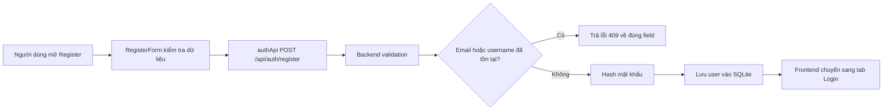
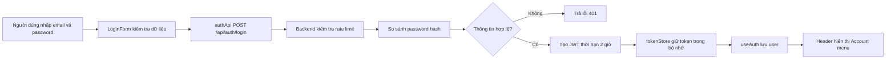
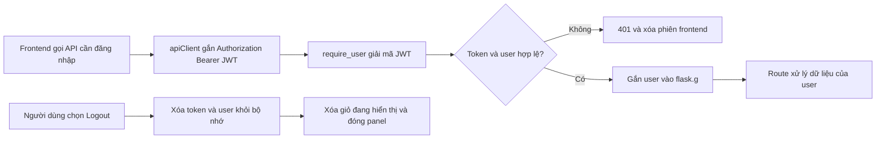

# 01 - Tài khoản người dùng

## 1. Giới thiệu

- Mục tiêu: cho phép người dùng đăng ký, đăng nhập, cập nhật hồ sơ và đăng xuất.
- Tài khoản là điều kiện để sử dụng giỏ hàng, checkout và xem lịch sử đơn hàng.
- Backend dùng Flask, SQLite và JWT; mật khẩu chỉ lưu dưới dạng hash.
- JWT có thời hạn 2 giờ và được frontend giữ trong bộ nhớ, không lưu vào `localStorage`.

## 2. File/source code liên quan

### Frontend

- `frontend/src/App.tsx`: giữ trạng thái mở modal và điều phối đăng nhập/đăng ký.
- `frontend/src/components/layout/Header.tsx`: hiển thị nút Login, Register hoặc menu tài khoản.
- `frontend/src/features/auth/components/AuthModal.tsx`: chuyển giữa hai tab Login và Create account.
- `frontend/src/features/auth/components/LoginForm.tsx`: nhập và kiểm tra email, mật khẩu.
- `frontend/src/features/auth/components/RegisterForm.tsx`: nhập username, email, mật khẩu và xác nhận mật khẩu.
- `frontend/src/features/auth/components/AccountMenu.tsx`: hiển thị hồ sơ, My Orders và Logout.
- `frontend/src/features/auth/components/ProfileForm.tsx`: cập nhật họ tên và số điện thoại.
- `frontend/src/features/auth/useAuth.ts`: quản lý user, token, đăng nhập và đăng xuất.
- `frontend/src/features/auth/authApi.ts`: gọi API đăng ký, đăng nhập và hồ sơ.
- `frontend/src/services/apiClient.ts`: gửi HTTP request và gắn Bearer token.
- `frontend/src/services/tokenStore.ts`: giữ token trong bộ nhớ và thông báo khi phiên kết thúc.

### Backend

- `backend/routes/auth.py`: API register, login, xem và sửa hồ sơ.
- `backend/auth.py`: tạo JWT và xác thực Bearer token.
- `backend/validation.py`: kiểm tra dữ liệu tài khoản.
- `backend/db.py` và `backend/schema.sql`: kết nối SQLite và bảng `users`, `login_limits`.
- `backend/tests/test_auth.py`: kiểm thử đăng ký, đăng nhập, JWT và phân quyền.

## 3. API chính

- `POST /api/auth/register`: tạo tài khoản mới.
- `POST /api/auth/login`: kiểm tra mật khẩu và trả JWT cùng thông tin user.
- `GET /api/me`: lấy tài khoản hiện tại từ JWT.
- `PATCH /api/me`: cập nhật họ tên và số điện thoại.
- Route cần đăng nhập dùng decorator `@require_user`.

## 4. Flow đăng ký

## 5. Flow đăng nhập

## 6. Flow xác thực API và đăng xuất

## 7. Điểm nhấn khi thuyết trình

- Frontend chỉ quản lý giao diện và phiên hiện tại; backend mới là nơi xác thực thật.
- Mật khẩu không được lưu trực tiếp, chỉ lưu `password_hash`.
- JWT bảo vệ các API cá nhân và xác định đúng người sở hữu dữ liệu.
- Rate limit giảm thử mật khẩu liên tục theo email và IP.
- Đăng xuất phía frontend xóa token ngay; token bị sao chép trước đó chỉ hết hiệu lực khi hết hạn.

## 8. Kịch bản demo ngắn

- Mở Register, thử dữ liệu thiếu để xem validation.
- Tạo tài khoản, sau đó đăng nhập bằng tài khoản vừa tạo.
- Mở Account menu và cập nhật họ tên hoặc số điện thoại.
- Đăng xuất và thử mở chức năng yêu cầu tài khoản.