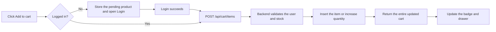
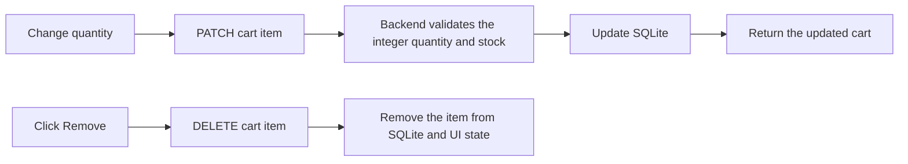

# 03 - Shopping Cart

## 1. Introduction

- Goal: store the products users want to buy and allow quantity changes or item removal.
- Each cart belongs to an account and is stored in SQLite.
- Users who are not logged in are prompted to log in before adding products.
- Prices and stock levels in responses come from the backend's product table.

## 2. Related Files and Source Code

### Frontend

- `frontend/src/App.tsx`: manages cart state, handles additions, updates, and removals, and opens checkout.
- `frontend/src/components/layout/Header.tsx`: displays the number of items in the cart.
- `frontend/src/features/cart/cartApi.ts`: calls the cart APIs.
- `CartDrawer.tsx`: the main cart drawer.
- `CartItem.tsx`: a product row with its quantity and remove button.
- `CartSummary.tsx`: the total amount and Checkout button.
- `EmptyCart.tsx`: the empty cart or logged-out state.
- `models/cartModel.ts`: data types, item counting, and displayed total calculations.

### Backend

- `backend/routes/cart.py`: APIs for reading, adding, updating, and removing cart items.
- `backend/auth.py`: validates JWTs and retrieves the current user.
- `backend/schema.sql`: the `cart_items` table links users to products.
- `backend/tests/test_cart_api.py`: tests ownership, stock checks, and validation.

## 3. Main APIs

- `GET /api/cart`: retrieves the current account's cart.
- `POST /api/cart/items`: adds a product or increases its quantity.
- `PATCH /api/cart/items/{product_id}`: sets a new quantity.
- `DELETE /api/cart/items/{product_id}`: removes a product.
- All cart APIs require a Bearer token.

## 4. Add Product Flow

## 5. Update and Remove Flow

## 6. Data Rules

- Each user has only one row per product in `cart_items`.
- Quantity must be a positive integer and must not exceed available stock.
- The backend only reads or updates the cart of `g.user`, identified by the JWT.
- The backend recalculates the subtotal from product prices rather than trusting frontend totals.
- Monetary amounts use integer VND values to avoid floating-point errors.

## 7. Presentation Highlights

- The cart is stored per account as well as in React state.
- After login, the product the user previously selected can be added automatically.
- The backend enforces ownership so one account cannot read another account's cart.
- Every change returns the updated cart to keep the badge, drawer, and total in sync.

## 8. Short Demo Scenario

- Add a product while logged out to open the Login modal.
- Log in and verify that the product automatically appears in the cart.
- Increase and decrease the quantity and check the total.
- Remove a product, then log out and back in to demonstrate that the cart is saved per account.
