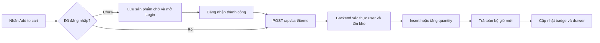
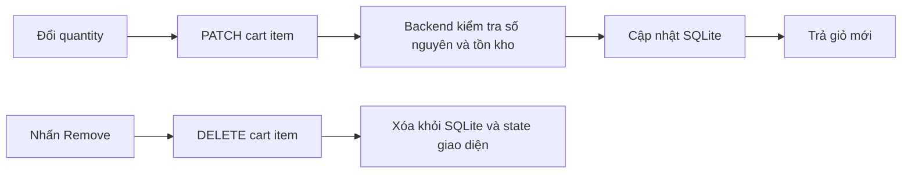

# 03 - Giỏ hàng

## 1. Giới thiệu

- Mục tiêu: lưu các sản phẩm người dùng muốn mua và cho phép đổi số lượng hoặc xóa.
- Giỏ hàng thuộc từng tài khoản và được lưu trong SQLite.
- Người chưa đăng nhập sẽ được yêu cầu đăng nhập trước khi thêm sản phẩm.
- Giá và tồn kho trong phản hồi được lấy từ bảng sản phẩm của backend.

## 2. File/source code liên quan

### Frontend

- `frontend/src/App.tsx`: giữ state giỏ, xử lý thêm, sửa, xóa và mở checkout.
- `frontend/src/components/layout/Header.tsx`: hiển thị số lượng sản phẩm trong giỏ.
- `frontend/src/features/cart/cartApi.ts`: gọi API giỏ hàng.
- `CartDrawer.tsx`: drawer tổng của giỏ.
- `CartItem.tsx`: một dòng sản phẩm, số lượng và nút xóa.
- `CartSummary.tsx`: tổng tiền và nút Checkout.
- `EmptyCart.tsx`: trạng thái giỏ trống hoặc chưa đăng nhập.
- `models/cartModel.ts`: kiểu dữ liệu, đếm số lượng và tính tổng hiển thị.

### Backend

- `backend/routes/cart.py`: API đọc, thêm, sửa và xóa giỏ.
- `backend/auth.py`: xác thực JWT và lấy user hiện tại.
- `backend/schema.sql`: bảng `cart_items` liên kết user với product.
- `backend/tests/test_cart_api.py`: kiểm thử ownership, tồn kho và validation.

## 3. API chính

- `GET /api/cart`: lấy giỏ của tài khoản hiện tại.
- `POST /api/cart/items`: thêm sản phẩm hoặc tăng số lượng.
- `PATCH /api/cart/items/{product_id}`: đặt số lượng mới.
- `DELETE /api/cart/items/{product_id}`: xóa sản phẩm.
- Tất cả API giỏ đều yêu cầu Bearer token.

## 4. Flow thêm sản phẩm

## 5. Flow sửa và xóa

## 6. Quy tắc dữ liệu

- Một user chỉ có một dòng cho mỗi product trong `cart_items`.
- Quantity phải là số nguyên dương và không vượt tồn kho.
- Backend chỉ đọc hoặc sửa giỏ của `g.user` từ JWT.
- Subtotal backend được tính lại từ giá sản phẩm, không tin tổng tiền từ frontend.
- Tiền dùng số nguyên VND để tránh sai số số thực.

## 7. Điểm nhấn khi thuyết trình

- Giỏ không chỉ nằm trong state React mà được lưu theo tài khoản.
- Đăng nhập xong có thể tự thêm sản phẩm người dùng vừa chọn trước đó.
- Backend bảo vệ ownership nên tài khoản này không đọc được giỏ của tài khoản khác.
- Mọi thay đổi trả lại giỏ mới để badge, drawer và tổng tiền đồng bộ.

## 8. Kịch bản demo ngắn

- Thêm sản phẩm khi chưa đăng nhập để mở modal Login.
- Đăng nhập và kiểm tra sản phẩm tự xuất hiện trong giỏ.
- Tăng, giảm số lượng và kiểm tra tổng tiền.
- Xóa sản phẩm, sau đó đăng xuất và đăng nhập lại để chứng minh giỏ lưu theo tài khoản.

