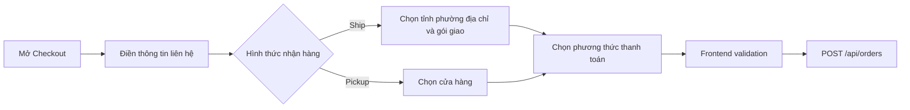
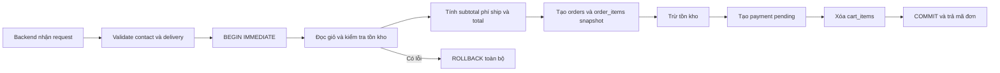

# 04 - Checkout và tạo đơn

## 1. Giới thiệu

- Mục tiêu: chuyển giỏ hàng thành đơn đã lưu trong database.
- Người dùng chọn giao tận nơi hoặc nhận tại cửa hàng.
- Hỗ trợ ba lựa chọn thanh toán: Card, QR Banking và Cash.
- Thanh toán hiện là mô phỏng; order và payment được tạo với trạng thái `pending`.

## 2. File/source code liên quan

### Frontend

- `frontend/src/App.tsx`: chuyển từ CartDrawer sang CheckoutModal.
- `frontend/src/features/checkout/components/CheckoutModal.tsx`: giữ form và gửi đơn.
- `ContactForm.tsx`: họ tên, email và điện thoại.
- `DeliveryOptions.tsx`, `ShippingAddressForm.tsx`: hình thức và địa chỉ giao nhận.
- `PaymentForm.tsx`: Card, QR Banking hoặc Cash.
- `OrderSummary.tsx`, `PackageInfo.tsx`: tóm tắt hàng, phí và kiện hàng.
- `OrderSuccess.tsx`: hiển thị mã đơn sau khi thành công.
- `models/checkoutModel.ts`: state mặc định, validation, phí giao hàng và tổng tiền.
- `ordersApi.ts`: gửi request tạo order.
- `data/vietnamDivisions.ts`: tỉnh/thành và phường/xã cho form.

### Backend

- `backend/routes/orders.py`: validate và tạo order bằng transaction.
- `backend/routes/cart.py`: cung cấp danh sách pickup store.
- `backend/data/vietnam_divisions.json`: kiểm tra mã địa chỉ phía server.
- `backend/data/pickup_stores.json`: dữ liệu cửa hàng nhận hàng.
- `backend/schema.sql`: bảng `orders`, `order_items`, `payments`.
- `backend/tests/test_orders_api.py`, `test_checkout_schema.py`: kiểm thử transaction và ràng buộc dữ liệu.

## 3. API chính

- `GET /api/pickup-stores`: lấy cửa hàng đang hoạt động.
- `POST /api/orders`: tạo đơn từ giỏ của user hiện tại.
- Frontend chỉ gửi thông tin liên hệ, giao nhận và phương thức thanh toán.
- Frontend không gửi subtotal, shipping fee hoặc total để backend tự tính lại.

## 4. Flow nhập thông tin checkout

## 5. Flow transaction tạo đơn

## 6. Quy tắc quan trọng

- Ship yêu cầu tỉnh, phường, địa chỉ và shipping method hợp lệ.
- Pickup yêu cầu cửa hàng còn active và phí ship bằng 0.
- Standard miễn phí; Express và Overnight có phí do backend quy định.
- Card chỉ được kiểm tra mô phỏng phía frontend; số thẻ không gửi và không lưu.
- Snapshot tên, ảnh và giá sản phẩm giúp đơn cũ không đổi khi catalog thay đổi.
- Transaction bảo đảm không có trạng thái trừ kho nhưng chưa tạo đơn hoặc ngược lại.

## 7. Điểm nhấn khi thuyết trình

- Backend là nguồn quyết định giá, phí và tồn kho cuối cùng.
- Checkout là thao tác nguyên tử: hoặc hoàn thành tất cả, hoặc rollback tất cả.
- Hai nhánh Ship/Pickup dùng dữ liệu khác nhau nhưng cùng tạo một cấu trúc order.
- Sau khi thành công, frontend xóa giỏ và giữ biên nhận để người dùng xác nhận.

## 8. Kịch bản demo ngắn

- Mở checkout từ giỏ có sản phẩm.
- Chuyển giữa Ship và Pickup để xem form thay đổi.
- Thử thiếu trường bắt buộc để xem validation.
- Chọn Cash để tạo đơn nhanh, sau đó trình bày mã đơn và tổng tiền.

