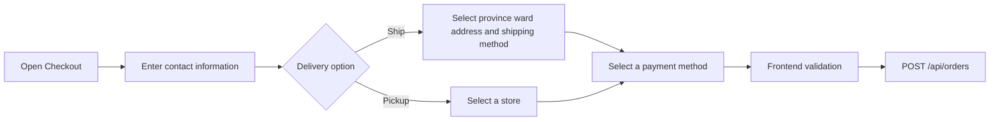
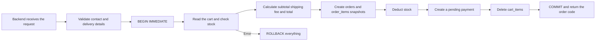

# 04 - Checkout and Order Creation

## 1. Introduction

- Goal: convert the cart into an order saved in the database.
- Users choose home delivery or store pickup.
- Three payment options are supported: Card, QR Banking, and Cash.
- Payments are currently simulated; orders and payments are created with the `pending` status.

## 2. Related Files and Source Code

### Frontend

- `frontend/src/App.tsx`: transitions from CartDrawer to CheckoutModal.
- `frontend/src/features/checkout/components/CheckoutModal.tsx`: manages the form and submits the order.
- `ContactForm.tsx`: full name, email, and phone number.
- `DeliveryOptions.tsx`, `ShippingAddressForm.tsx`: delivery options and address.
- `PaymentForm.tsx`: Card, QR Banking, or Cash.
- `OrderSummary.tsx`, `PackageInfo.tsx`: summaries of items, fees, and package information.
- `OrderSuccess.tsx`: displays the order code after successful checkout.
- `models/checkoutModel.ts`: default state, validation, shipping fees, and totals.
- `ordersApi.ts`: sends order creation requests.
- `data/vietnamDivisions.ts`: provinces/cities and wards/communes for the form.

### Backend

- `backend/routes/orders.py`: validates and creates orders within a transaction.
- `backend/routes/cart.py`: provides the pickup store list.
- `backend/data/vietnam_divisions.json`: validates address codes on the server.
- `backend/data/pickup_stores.json`: pickup store data.
- `backend/schema.sql`: the `orders`, `order_items`, and `payments` tables.
- `backend/tests/test_orders_api.py`, `test_checkout_schema.py`: tests transactions and data constraints.

## 3. Main APIs

- `GET /api/pickup-stores`: retrieves active stores.
- `POST /api/orders`: creates an order from the current user's cart.
- The frontend sends only contact information, delivery details, and the payment method.
- The frontend does not send the subtotal, shipping fee, or total; the backend calculates them independently.

## 4. Checkout Information Flow

## 5. Order Creation Transaction Flow

## 6. Important Rules

- Ship requires a valid province, ward, address, and shipping method.
- Pickup requires an active store and has a shipping fee of 0.
- Standard shipping is free; Express and Overnight fees are defined by the backend.
- Card validation is simulated on the frontend only; card numbers are neither sent nor stored.
- Snapshots of product names, images, and prices keep past orders unchanged when the catalog changes.
- The transaction ensures that stock deductions and order creation succeed or fail together.

## 7. Presentation Highlights

- The backend determines the final prices, fees, and stock levels.
- Checkout is atomic: either all operations complete or all changes are rolled back.
- The Ship and Pickup branches use different data but create the same order structure.
- After success, the frontend clears the cart and retains the receipt for the user to review.

## 8. Short Demo Scenario

- Open checkout from a cart containing products.
- Switch between Ship and Pickup to show how the form changes.
- Leave required fields empty to demonstrate validation.
- Select Cash to create an order quickly, then show the order code and total.
