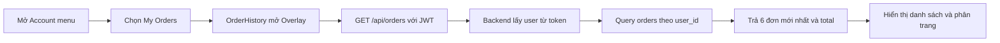
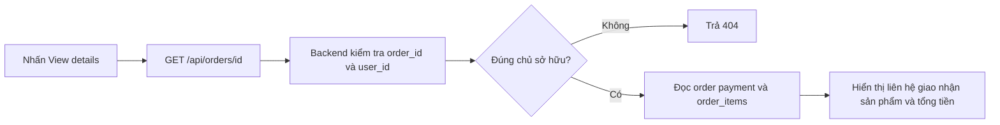

# 05 - Lịch sử đơn hàng

## 1. Giới thiệu

- Mục tiêu: cho người dùng xem lại các đơn đã tạo và chi tiết từng đơn.
- Chỉ tài khoản đã đăng nhập mới truy cập được My Orders.
- Danh sách sắp xếp mới nhất trước và hiển thị 6 đơn mỗi trang.
- Dữ liệu lịch sử dùng snapshot được lưu khi checkout, không phụ thuộc catalog hiện tại.

## 2. File/source code liên quan

### Frontend

- `frontend/src/features/auth/components/AccountMenu.tsx`: mở My Orders.
- `frontend/src/features/orders/OrderHistory.tsx`: danh sách, phân trang và chi tiết đơn.
- `frontend/src/features/orders/orders.css`: bố cục responsive của lịch sử.
- `frontend/src/features/checkout/ordersApi.ts`: gọi API danh sách và chi tiết.
- `frontend/src/components/ui/Overlay.tsx`: hiển thị lịch sử dạng overlay.
- `frontend/src/services/apiClient.ts`: gắn JWT vào request.

### Backend

- `backend/routes/orders.py`: API danh sách và chi tiết theo user.
- `backend/auth.py`: xác thực JWT trước khi đọc đơn.
- `backend/schema.sql`: bảng `orders`, `order_items`, `payments`.
- `backend/tests/test_orders_api.py`: kiểm thử phân trang, ownership và dữ liệu snapshot.

## 3. API chính

- `GET /api/orders?page=1&page_size=6`: lấy danh sách đơn của user.
- `GET /api/orders/{id}`: lấy chi tiết một đơn của user.
- Hai API đều yêu cầu Bearer token.
- Đơn không thuộc user hiện tại được trả về như không tồn tại.

## 4. Flow danh sách đơn

## 5. Flow xem chi tiết

## 6. Trạng thái giao diện

- Loading: thông báo đang tải đơn.
- Empty: thông báo chưa có đơn sau checkout.
- Error: hiển thị lỗi và nút Retry.
- Detail: có nút quay lại danh sách đơn.
- Request đang chạy bị hủy khi đổi trang, đổi đơn hoặc đóng overlay.

## 7. Điểm nhấn khi thuyết trình

- Ownership được kiểm tra ở câu SQL bằng cả `order_id` và `user_id`.
- Một tài khoản không thể xem đơn của tài khoản khác bằng cách đổi URL ID.
- Snapshot giữ đúng tên, ảnh và giá tại thời điểm mua.
- Danh sách chỉ lấy dữ liệu tóm tắt; chi tiết chỉ tải khi người dùng yêu cầu.
- Chức năng hiện chỉ xem trạng thái, chưa có tracking, hủy đơn hoặc xác nhận thanh toán.

## 8. Kịch bản demo ngắn

- Đăng nhập tài khoản đã có đơn và mở Account > My Orders.
- Chuyển trang nếu có nhiều hơn 6 đơn.
- Mở một đơn để xem sản phẩm, giao nhận và thanh toán.
- Đăng nhập tài khoản khác để chứng minh dữ liệu được tách theo user.

