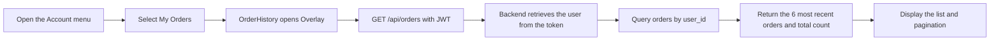
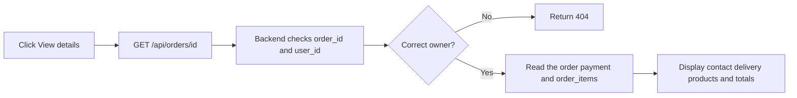

# 05 - Order History

## 1. Introduction

- Goal: allow users to review their orders and view the details of each order.
- Only logged-in accounts can access My Orders.
- Orders are sorted newest first, with 6 orders per page.
- Order history uses snapshots saved at checkout and does not depend on the current catalog.

## 2. Related Files and Source Code

### Frontend

- `frontend/src/features/auth/components/AccountMenu.tsx`: opens My Orders.
- `frontend/src/features/orders/OrderHistory.tsx`: order list, pagination, and order details.
- `frontend/src/features/orders/orders.css`: responsive order history layout.
- `frontend/src/features/checkout/ordersApi.ts`: calls the order list and detail APIs.
- `frontend/src/components/ui/Overlay.tsx`: displays order history in an overlay.
- `frontend/src/services/apiClient.ts`: attaches the JWT to requests.

### Backend

- `backend/routes/orders.py`: APIs for each user's order list and details.
- `backend/auth.py`: validates JWTs before reading orders.
- `backend/schema.sql`: the `orders`, `order_items`, and `payments` tables.
- `backend/tests/test_orders_api.py`: tests pagination, ownership, and snapshot data.

## 3. Main APIs

- `GET /api/orders?page=1&page_size=6`: retrieves the user's order list.
- `GET /api/orders/{id}`: retrieves the details of one of the user's orders.
- Both APIs require a Bearer token.
- Orders that do not belong to the current user are treated as nonexistent.

## 4. Order List Flow

## 5. Order Detail Flow

## 6. UI States

- Loading: displays a message indicating that orders are loading.
- Empty: displays a message when no orders have been created through checkout yet.
- Error: displays the error and a Retry button.
- Detail: includes a button to return to the order list.
- In-flight requests are canceled when changing pages, switching orders, or closing the overlay.

## 7. Presentation Highlights

- Ownership is checked in the SQL query using both `order_id` and `user_id`.
- An account cannot view another account's orders by changing the ID in the URL.
- Snapshots preserve the product name, image, and price at the time of purchase.
- The list retrieves only summary data; details are loaded only when requested by the user.
- The feature currently displays status only; tracking, order cancellation, and payment confirmation are not yet available.

## 8. Short Demo Scenario

- Log in to an account with existing orders and open Account > My Orders.
- Change pages if there are more than 6 orders.
- Open an order to view its products, delivery details, and payment information.
- Log in to another account to demonstrate that data is separated by user.
