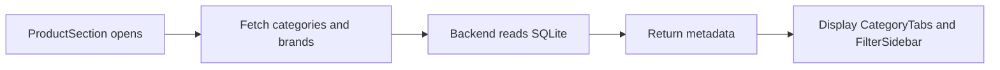

# 02 - Products, Search, and Filters

## 1. Introduction

- Goal: help users find the right gaming gear by keyword and specifications.
- Category, brand, price, connection, size, and refresh rate filters are applied on the backend.
- Results are paginated with 12 products per page to reduce the data loaded per request.
- Product APIs are public, so users can browse and search without logging in.

## 2. Related Files and Source Code

### Frontend

- `frontend/src/features/products/components/ProductSection.tsx`: manages search, filters, pagination, and loading state.
- `SearchBar.tsx`: accepts search keywords.
- `CategoryTabs.tsx`: selects the product category.
- `FilterSidebar.tsx`, `FilterGroup.tsx`, `PriceFilter.tsx`: interfaces for filter groups.
- `filterModel.ts`: data types, default values, and price range validation.
- `productsApi.ts`: builds query strings and calls the catalog API.
- `ProductGrid.tsx`, `ProductCard.tsx`: display results and add-to-cart buttons.
- `frontend/public/products`: product images served to the browser.

### Backend

- `backend/routes/products.py`: APIs for product lists, details, categories, and brands.
- `backend/data/products.json`: source data for product seeding.
- `backend/seed.py`: inserts seed data into SQLite.
- `backend/schema.sql`: the `products`, `categories`, `brands`, and `product_connections` tables.
- `backend/tests/test_products_api.py`: tests search, filtering, and pagination.

## 3. Main APIs

- `GET /api/products`: searches, filters, and paginates products.
- `GET /api/products/{id}`: retrieves a product's details.
- `GET /api/categories`: retrieves categories for the tabs.
- `GET /api/brands`: retrieves brands for the filters.
- Common query parameters: `q`, `category`, `brand`, `connection`, `min_price`, `max_price`, `screen_size`, `refresh_rate`, `page`.

## 4. Category and Filter Loading Flow

## 5. Product Search Flow

```mermaid
flowchart LR
    A[Enter a keyword or change filters] --> B[Reset to page 1]
    B --> C[Wait for the 250 ms search debounce]
    C --> D[productsApi builds the query string]
    D --> E[GET /api/products]
    E --> F[Backend validates the query]
    F --> G[SQL filters products and counts total results]
    G --> H[Return items and pagination]
    H --> I[ProductGrid displays products]
```

## 6. UI States

- Loading: displays `Loading products`.
- Empty: allows users to reset all filter criteria.
- Validation: reports an error when the minimum price exceeds the maximum price.
- Network/API error: displays a message and a Retry button.
- Previous requests are canceled using `AbortController` when the criteria change.

## 7. Presentation Highlights

- The frontend sends the criteria; the backend performs the filtering.
- SQL uses parameters rather than directly concatenating user input.
- Debouncing avoids sending an API request for every rapid keystroke.
- Pagination keeps the interface lightweight and lets the backend return only the required data.
- Categories and brands come from the database rather than hardcoded lists in the interface.

## 8. Short Demo Scenario

- Enter a product name or brand to show how the results change.
- Select a category, brand, and connection type.
- Try an invalid price range to demonstrate validation.
- Change pages and use Reset to return to all products.
