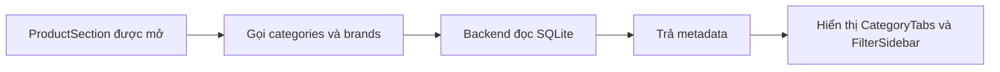
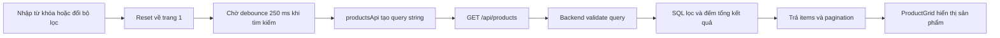

# 02 - Sản phẩm, tìm kiếm và bộ lọc

## 1. Giới thiệu

- Mục tiêu: giúp người dùng tìm đúng gaming gear theo từ khóa và thông số.
- Danh mục, hãng, giá, kết nối, kích thước và tần số quét được lọc phía backend.
- Kết quả được phân trang 12 sản phẩm để giảm dữ liệu tải mỗi lần.
- API sản phẩm là public, người dùng chưa đăng nhập vẫn xem và tìm kiếm được.

## 2. File/source code liên quan

### Frontend

- `frontend/src/features/products/components/ProductSection.tsx`: giữ state tìm kiếm, bộ lọc, phân trang và trạng thái tải.
- `SearchBar.tsx`: nhận từ khóa tìm kiếm.
- `CategoryTabs.tsx`: chọn danh mục sản phẩm.
- `FilterSidebar.tsx`, `FilterGroup.tsx`, `PriceFilter.tsx`: giao diện các nhóm lọc.
- `filterModel.ts`: kiểu dữ liệu, giá trị mặc định và kiểm tra khoảng giá.
- `productsApi.ts`: tạo query string và gọi API catalog.
- `ProductGrid.tsx`, `ProductCard.tsx`: hiển thị kết quả và nút thêm giỏ.
- `frontend/public/products`: ảnh sản phẩm được trình duyệt phục vụ.

### Backend

- `backend/routes/products.py`: API danh sách, chi tiết, danh mục và hãng.
- `backend/data/products.json`: dữ liệu nguồn để seed sản phẩm.
- `backend/seed.py`: đưa dữ liệu seed vào SQLite.
- `backend/schema.sql`: bảng `products`, `categories`, `brands`, `product_connections`.
- `backend/tests/test_products_api.py`: kiểm thử tìm kiếm, lọc và phân trang.

## 3. API chính

- `GET /api/products`: tìm kiếm, lọc và phân trang sản phẩm.
- `GET /api/products/{id}`: lấy chi tiết một sản phẩm.
- `GET /api/categories`: lấy danh mục cho tab.
- `GET /api/brands`: lấy hãng cho bộ lọc.
- Query thường dùng: `q`, `category`, `brand`, `connection`, `min_price`, `max_price`, `screen_size`, `refresh_rate`, `page`.

## 4. Flow tải danh mục và bộ lọc

## 5. Flow tìm kiếm sản phẩm

## 6. Trạng thái giao diện

- Loading: hiển thị `Loading products`.
- Empty: cho phép đặt lại toàn bộ điều kiện lọc.
- Validation: báo lỗi khi giá tối thiểu lớn hơn giá tối đa.
- Network/API error: hiển thị thông báo và nút Retry.
- Request cũ bị hủy bằng `AbortController` khi điều kiện thay đổi.

## 7. Điểm nhấn khi thuyết trình

- Frontend chỉ gửi điều kiện; backend là nơi lọc dữ liệu thật.
- SQL dùng tham số thay vì ghép trực tiếp giá trị người dùng.
- Debounce tránh gửi API sau từng phím quá nhanh.
- Phân trang giúp giao diện nhẹ và backend trả đúng phần dữ liệu cần thiết.
- Danh mục và hãng lấy từ database, không phụ thuộc danh sách viết cứng trên giao diện.

## 8. Kịch bản demo ngắn

- Nhập tên hoặc hãng sản phẩm để xem kết quả thay đổi.
- Chọn danh mục, hãng và kiểu kết nối.
- Thử khoảng giá không hợp lệ để xem validation.
- Chuyển trang và dùng Reset để trở lại toàn bộ sản phẩm.

