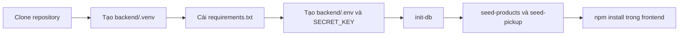
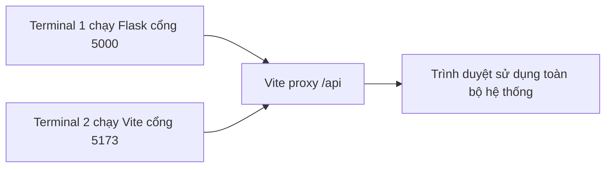
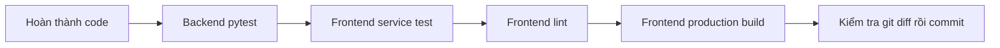

# 06 - Chạy và kiểm thử hệ thống

## 1. Giới thiệu

- Hệ thống gồm React/Vite frontend, Flask backend và SQLite database.
- Vite chạy ở cổng `5173` và proxy request `/api` tới Flask ở cổng `5000`.
- Mỗi thành viên cần cài Node.js và Python trước khi chạy dự án.
- File `.env`, virtual environment, `node_modules` và database local không được commit.

## 2. File/source code liên quan

- `frontend/package.json`: lệnh dev, build, lint và test service.
- `frontend/vite.config.ts`: cấu hình React và proxy `/api`.
- `frontend/scripts/test-services.mjs`: kiểm tra tokenStore và apiClient.
- `backend/requirements.txt`: dependency Python.
- `backend/.env.example`: mẫu biến môi trường.
- `backend/app.py`: tạo Flask app và đăng ký route.
- `backend/db.py`, `backend/schema.sql`: khởi tạo database.
- `backend/seed.py`, `backend/data/*`: seed sản phẩm và pickup store.
- `backend/tests`: test API và database.

## 3. Flow chuẩn bị môi trường lần đầu



## 4. Thiết lập backend lần đầu

- Chạy từ thư mục gốc `Web_29GG`.

```powershell
python -m venv backend\.venv
.\backend\.venv\Scripts\python.exe -m pip install -r backend\requirements.txt
Copy-Item backend\.env.example backend\.env
.\backend\.venv\Scripts\python.exe -c "import secrets; print(secrets.token_hex(32))"
```

- Dán chuỗi vừa tạo vào `SECRET_KEY` trong `backend/.env`.

```powershell
.\backend\.venv\Scripts\python.exe -m flask --app backend/app.py init-db
.\backend\.venv\Scripts\python.exe -m flask --app backend/app.py seed-products
.\backend\.venv\Scripts\python.exe -m flask --app backend/app.py seed-pickup
```

## 5. Chạy hệ thống



- Terminal backend, chạy từ thư mục gốc:

```powershell
.\backend\.venv\Scripts\python.exe -m flask --app backend/app.py run --debug --port 5000
```

- Terminal frontend:

```powershell
cd frontend
npm.cmd install
npm.cmd run dev
```

- Frontend: `http://127.0.0.1:5173`.
- Health check: `http://127.0.0.1:5000/api/health`.

## 6. Flow kiểm thử trước khi push



## 7. Các lệnh kiểm thử

- Backend, chạy từ thư mục gốc:

```powershell
.\backend\.venv\Scripts\python.exe -m pytest -q backend/tests
```

- Frontend, chạy trong `frontend`:

```powershell
npm.cmd run test:services
npm.cmd run lint
npm.cmd run build
```

- Test riêng order history và checkout:

```powershell
.\backend\.venv\Scripts\python.exe -m pytest backend/tests/test_orders_api.py -q
```

## 8. Ý nghĩa từng nhóm test

- Backend pytest: validation, JWT, ownership, catalog, cart, transaction và order history.
- `test:services`: Bearer token, lỗi API, session cũ, network error và response không hợp lệ.
- Lint: phát hiện lỗi cú pháp và quy tắc code frontend.
- Build: kiểm tra TypeScript và khả năng tạo bản production.
- Test dùng database tạm, không sửa tài khoản hoặc đơn trong database local.

## 9. Lỗi thường gặp

- Không thấy Python trong `.venv`: chạy lại `python -m venv backend\.venv`.
- Backend báo thiếu `SECRET_KEY`: tạo `backend/.env` và dùng khóa ít nhất 32 ký tự.
- Frontend gọi API lỗi: kiểm tra Flask có chạy đúng cổng `5000`.
- Không có sản phẩm hoặc pickup store: chạy lại hai lệnh seed.
- PowerShell chặn `npm.ps1`: dùng `npm.cmd`.

## 10. Kịch bản trình bày ngắn

- Giới thiệu kiến trúc ba phần: React, Flask, SQLite.
- Chạy backend và mở health check.
- Chạy frontend, thực hiện một luồng mua hàng ngắn.
- Chạy test backend và frontend để chứng minh hệ thống ổn định.

