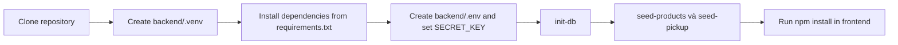
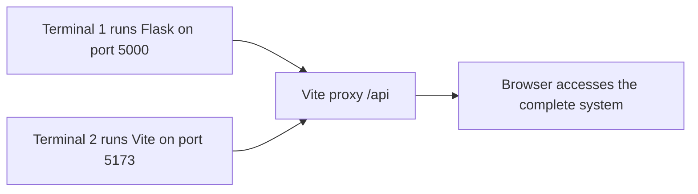
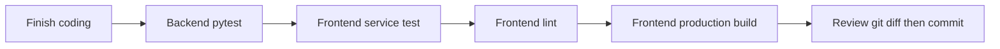

# 06 - Running and Testing the System

## 1. Introduction

- The system consists of a React/Vite frontend, a Flask backend, and a SQLite database.
- Vite runs on port `5173` and proxies `/api` requests to Flask on port `5000`.
- Each team member must install Node.js and Python before running the project.
- Do not commit `.env` files, virtual environments, `node_modules`, or local databases.

## 2. Related Files and Source Code

- `frontend/package.json`: commands for development, builds, linting, and service tests.
- `frontend/vite.config.ts`: React configuration and the `/api` proxy.
- `frontend/scripts/test-services.mjs`: tests tokenStore and apiClient.
- `backend/requirements.txt`: Python dependencies.
- `backend/.env.example`: environment variable template.
- `backend/app.py`: creates the Flask app and registers routes.
- `backend/db.py`, `backend/schema.sql`: initialize the database.
- `backend/seed.py`, `backend/data/*`: seed products and pickup stores.
- `backend/tests`: API and database tests.

## 3. Initial Environment Setup Flow



## 4. Initial Backend Setup

- Run from the `Web_29GG` project root.

```powershell
python -m venv backend\.venv
.\backend\.venv\Scripts\python.exe -m pip install -r backend\requirements.txt
Copy-Item backend\.env.example backend\.env
.\backend\.venv\Scripts\python.exe -c "import secrets; print(secrets.token_hex(32))"
```

- Paste the generated string into `SECRET_KEY` in `backend/.env`.

```powershell
.\backend\.venv\Scripts\python.exe -m flask --app backend/app.py init-db
.\backend\.venv\Scripts\python.exe -m flask --app backend/app.py seed-products
.\backend\.venv\Scripts\python.exe -m flask --app backend/app.py seed-pickup
```

## 5. Running the System



- Backend terminal, run from the project root:

```powershell
.\backend\.venv\Scripts\python.exe -m flask --app backend/app.py run --debug --port 5000
```

- Frontend terminal:

```powershell
cd frontend
npm.cmd install
npm.cmd run dev
```

- Frontend: `http://127.0.0.1:5173`.
- Health check: `http://127.0.0.1:5000/api/health`.

## 6. Testing Flow Before Pushing



## 7. Test Commands

- Backend, run from the project root:

```powershell
.\backend\.venv\Scripts\python.exe -m pytest -q backend/tests
```

- Frontend, run from `frontend`:

```powershell
npm.cmd run test:services
npm.cmd run lint
npm.cmd run build
```

- Run the order history and checkout tests separately:

```powershell
.\backend\.venv\Scripts\python.exe -m pytest backend/tests/test_orders_api.py -q
```

## 8. What Each Test Group Covers

- Backend pytest: validation, JWTs, ownership, catalog, cart, transactions, and order history.
- `test:services`: Bearer tokens, API errors, stale sessions, network errors, and invalid responses.
- Lint: detects syntax errors and violations of frontend coding rules.
- Build: checks TypeScript and verifies that a production build can be generated.
- Tests use temporary databases and do not modify accounts or orders in the local database.

## 9. Common Issues

- Python is missing from `.venv`: rerun `python -m venv backend\.venv`.
- The backend reports a missing `SECRET_KEY`: create `backend/.env` and use a key with at least 32 characters.
- Frontend API calls fail: check that Flask is running on port `5000`.
- No products or pickup stores are available: rerun both seed commands.
- PowerShell blocks `npm.ps1`: use `npm.cmd`.

## 10. Short Presentation Scenario

- Introduce the three-part architecture: React, Flask, and SQLite.
- Start the backend and open the health check endpoint.
- Start the frontend and demonstrate a short purchase flow.
- Run backend and frontend tests to demonstrate system stability.

